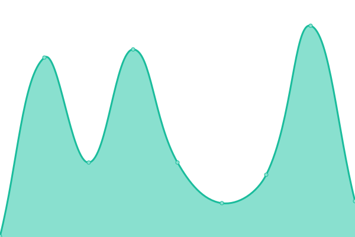

# [📈 Live Status](https://uptime.rainmaker.bet): <!--live status--> **🟧 部分停机**

This repository contains the open-source uptime monitor and status page for [Alioth-Wang](https://uptime.rainmaker.bet), powered by [Upptime](https://github.com/upptime/upptime).

With [Upptime](https://upptime.js.org), you can get your own unlimited and free uptime monitor and status page, powered entirely by a GitHub repository. We use [Issues](https://github.com/Alioth-Wang/MyWEB-UPtime/issues) as incident reports, [Actions](https://github.com/Alioth-Wang/MyWEB-UPtime/actions) as uptime monitors, and [Pages](https://uptime.rainmaker.bet) for the status page.

<!--start: status pages-->
<!-- This summary is generated by Upptime (https://github.com/upptime/upptime) -->
<!-- Do not edit this manually, your changes will be overwritten -->
<!-- prettier-ignore -->
| 链接 | 状态 | 历史 | 响应时间 | 正常运行时间 |
| --- | ------ | ------- | ------------- | ------ |
|  [MyBlog](https://realism.world) | 🟥 停机 | [my-blog.yml](https://github.com/Alioth-Wang/MyWEB-UPtime/commits/HEAD/history/my-blog.yml) | 

 0毫秒
     
 | 

<a href="https://uptime.rainmaker.bet/history/my-blog">0.00%</a>
    

|  [Hytron](https://idc.hytron.io) | 🟩 正常运行 | [hytron.yml](https://github.com/Alioth-Wang/MyWEB-UPtime/commits/HEAD/history/hytron.yml) | 

 820毫秒
     
 | 

<a href="https://uptime.rainmaker.bet/history/hytron">100.00%</a>
    

<!--end: status pages-->

[**Visit our status website →**](https://uptime.rainmaker.bet)

## 📄 License

- Powered by: [Upptime](https://github.com/upptime/upptime)
- Code: [MIT](./LICENSE) © [Alioth-Wang](https://uptime.rainmaker.bet)
- Data in the `./history` directory: [Open Database License](https://opendatacommons.org/licenses/odbl/1-0/)
